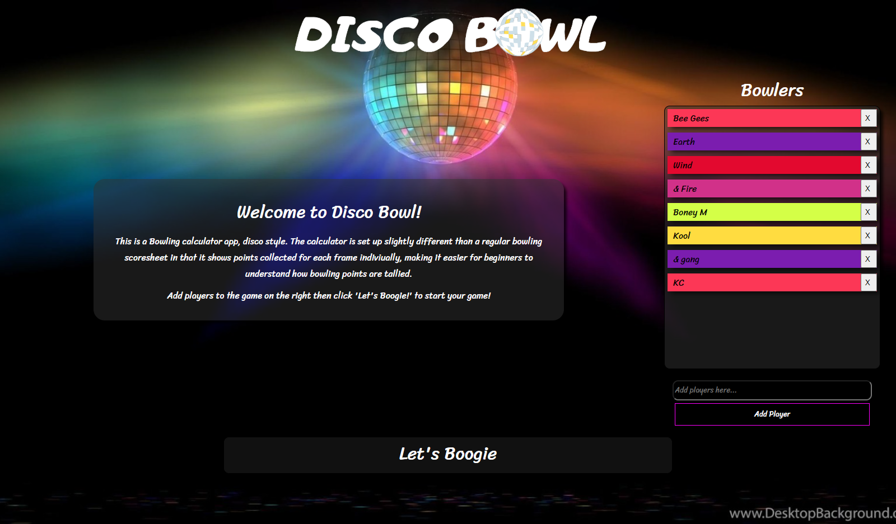
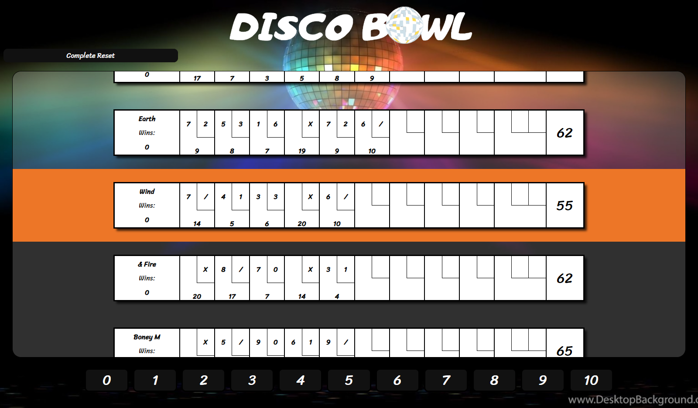
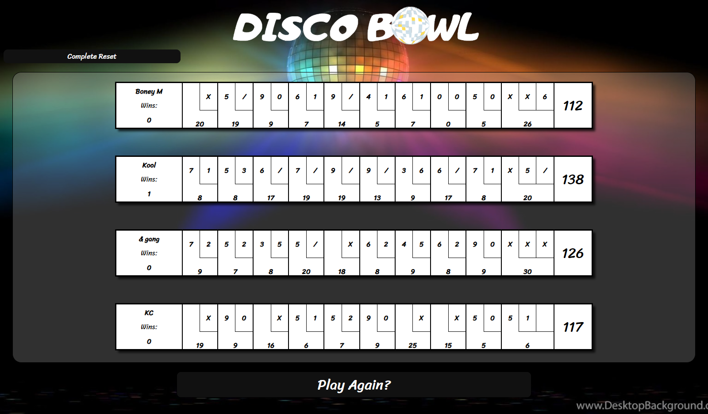

# Bowler

## Do you know how bowling is scored?

Me neither, so I googled it then created made a simple app that lets you play out rounds of bowling with as many players as you want. Alternating each player, enter how many pins they got on their throw and watch the scorecard fill out itself. It's also Disco themed.

## A different scorecard

The scorecard that i've made here is slightly different than your regular scorecard. Instead of each frame being a collective count of your points so far, the frame has its own score which denotes the amount of points earned for that frame on its own (including bonus from spare/strike/etc). I think it's a much nicer scorecard for a beginner to look at!

## How to use it?

1. Add players to the bowler section by name, play with as many players as you like. Then press 'Let's Boogie'.

2. Starting from the top and alternating through players, enter a number of pins until the game is over. The game handles whos turn it is and how the frames work, all you have to do is enter the pin number.

3. Once the game is over, the winner is awarded a point and you can play again! You can also go back to the home page and restart your game.

## Improvments 

